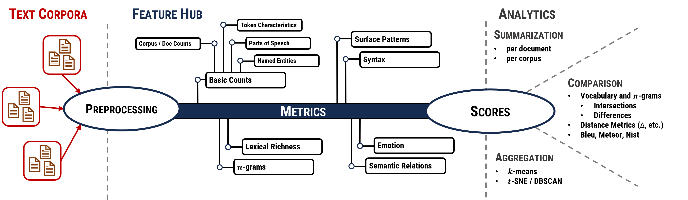

# DoPa Meter - A Tool Suite for the Metrical Document Profiling and Aggreation

This is _DoPa Meter_ - a tool suite that subsumes a wide range of established metrics of text analysis under one coverage.
It is based on [Python 3](https://www.python.org/) and [spaCy](https://spacy.io/).
(Running is preferred under Linux (preferred [Ubuntu](https://ubuntu.com/) and partly under Microsoft Windows.)

The system is build by a modular architecture, including a multilingual approach.
It is designed in a decentralized manner estimating features of various sources at different places and merge partial results.

Three components build the basis:
  1. _Text corpora_ as the input and a preprocessing pipeline,
  2. _Feature Hub_: A set of features, that compute _counts_ and _metrics_ of text corpora and
  3. A three-parted _analytics section_:
     1. Summarization mode: of simple reports for whole corpora and single documents, 
     2. Comparison: simple comparisons (e.g., vocabulary, $n$-grams) via intersections and differences
     3. Aggregation: clustering by _k_-means and _t_-SNE with _DBSCAN_

## Functionality



## Quick Introduction

* Installation
  * Install [Python 3](https://www.python.org/)
  * Install [spaCy language modules](https://spacy.io/models) and other external resources via `python install_languages.py lang_install.json`
    * Working for German and English language and all spaCy compatible languages
    * Warnings:
      * Constituency metrics use the [Berkeley Neural Parser](https://github.com/nikitakit/self-attentive-parser), [check](https://askubuntu.com/questions/633176/how-to-know-if-my-gpu-supports-cuda) if your device is CUDA compatible.

* Starting _DoPa Meter_
  * Configure your text corpora: one corpus is set up by a directory including single text files
    * [Example corpora set up](doc/res/example_corpora)
* Configure your config.json
  * [Example configuration files](doc/res/example_configurations)
  * very simple example
 
 
```json lines 
{
  "corpora": {
    "gra": {
      "path_text_data": "doc/res/example_corpora/gra",
      "language": "de"
    },
    "wiki": {
      "path_text_data": "doc/res/example_corpora/wiki",
      "language": "de"
    }
  },
  "settings": {
    "tasks": ["features", "counts", "corpus_characteristics"],
    "store_sources": true,
    "file_format_features": ["csv"],
    "file_format_clustering": "csv",
    "file_format_plots": ["png", "svg"],
    "file_format_dicts": "txt",
    "boxplot_height": 5,
    "most_frequent_words": 2000
  },
  "output": {
      "path_features":        "/doc/res/results/features",
      "path_features_detail": "/doc/res/results/features_detail",
      "path_summary":         "/doc/res/results/summary",
      "path_compare":         "/doc/res/results/compare",
      "path_counts":          "/doc/res/results/counts",
      "path_sources":         "/doc/res/results/sources",
      "path_clusters":        "/doc/res/results/clusters"
    },
  "features": {
    "token_characteristics": "default",
    "pos": "default",
    "ner": "default",
    "surface": "default",
    "lexical_richness": "default",
    "syntax_dependency_metrics" : "default",
    "syntax_dependency_tree" : "default",
    "wordnet_semantic_relations": "default",
    "wordnet_senses": "default",
    "wordnet_synsets": "default",
    "emotion": "default"
  }
}
```

* Open a terminal, root in the directory of _DoPa Meter_ and type `python main.py config.json` 

## Detailed Documenation

1. [Installation](doc/installation.md)
2. [Input and Data Preparation](doc/input.md)
3. [Functionality and Definition of Tasks](doc/tasks.md)
4. [Feature Hub](doc/features.md)
5. Analytics
   * [Summarization](doc/analytics/summarization.md)
   * [Comparison](doc/analytics/comparison.md)
   * [Aggregation](doc/analytics/aggregation.md)
6. [Configuration and Run](doc/configuration.md)
