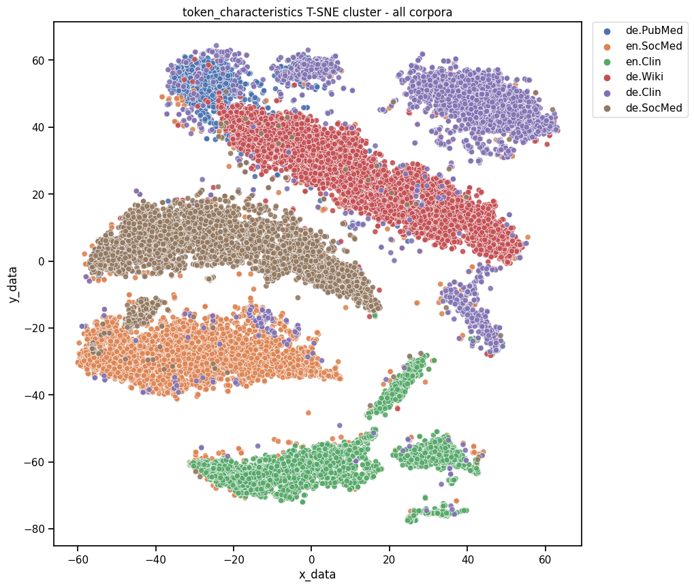
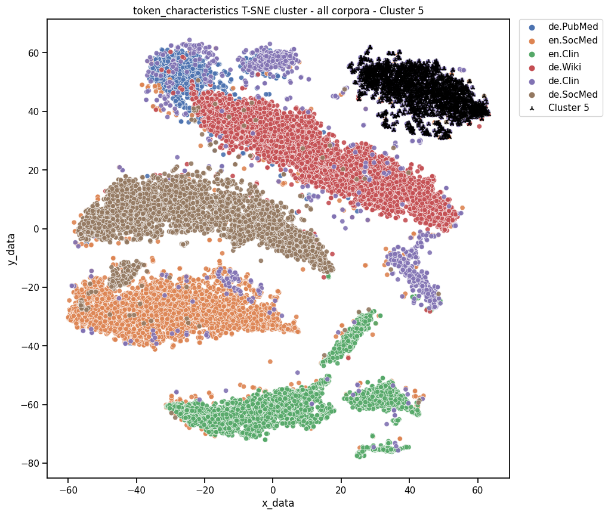
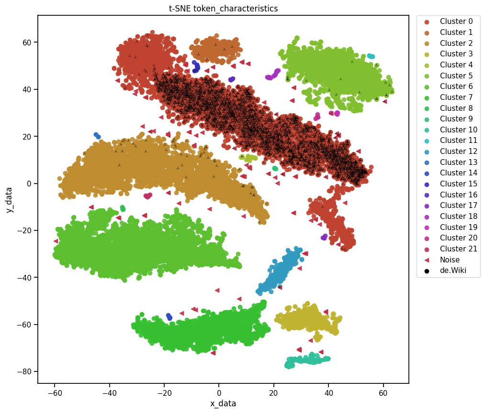

# Aggregation / Clustering

The aggregation mode is able to compute dependencies between different corpora via 2 clustering modes:
* [_k_-means](https://scikit-learn.org/stable/modules/generated/sklearn.cluster.KMeans.html#sklearn.cluster.KMeans),
* [_t_-distributed Stochastic Neighbor Embedding (t-SNE)](https://scikit-learn.org/stable/modules/generated/sklearn.manifold.TSNE.html#sklearn.manifold.TSNE) with [DBSCAN](https://scikit-learn.org/stable/modules/clustering.html#dbscan).
Fot these steps, [scikit-learn](https://scikit-learn.org) library is used.
This modular architecture is open to extension by a wider range of additional clustering algorithms and other machine learning libraries.

# Configuration

* `"corpora""`: Define the corpora for your analysis of clusters!
* `"features"`: Define the feature sets for your analysis of clusters!

* **Decentralized approach:**
  * You can run the task `"cluster"` on different places.
  * You can combine the features via task `"cluster"` if you copy the features `"path_features"` into one directory `"path_features"` and define it into one [configuration file](../res/example_configurations).    

* Name the 2 modes via in the configuration file, here default is activated:

* `"cluster" : {
    "k-means": "default",
    "t-sne": "default"
  }`


## Configuration: _k_-means 

* Note: _k_-means used an internal [MinMaxScaler](https://scikit-learn.org/stable/modules/generated/sklearn.preprocessing.MinMaxScaler.html#sklearn.preprocessing.MinMaxScaler) of the features before clustering. 
* Default adjustments of _k_-means (following scores loaded automatically)
  * `"n_clusters":` : if you do not define the number of clusters, n is defined by the amount of corpora
  * `"random_state": "None"`
  * `"n_init": 50`
  * `"max_iter": 300`

* Detailed configuration

    ```jsonlines
      "features": {
        "lexical_richness": "default",
        "negation": "default",
        "ner": "default",
        "pos": "default",
        "emotion": "default",
        "token_characteristics": "default",
        "surface": "default",
        "syntax_dependency_metrics" : "default",
        "syntax_dependency_tree": "default"
      },
      "cluster" : {
        "k-means": {
          "n_clusters": 5,
          "random_state": "None",
          "n_init": 50,
          "max_iter": 300
        }
      }
    ```

## Configuration _t_-SNE and DBSCAN

* Default adjustments of t-sne (following scores loaded automatically)
  * `"n_components": 2`
  * `"random_state": 1`
  * `"perplexity": 500` - - Note: be aware, that the defined value of perplexity is at least the amount of single documents.
  * `"learning_rate": 500`
  * `"init": "pca"`
  * `"eps": 2`
  * `"min_samples": 5`

* Detailed configuration

    ```jsonlines
      "features": {
        "lexical_richness": "default",
        "negation": "default",
        "ner": "default",
        "pos": "default",
        "emotion": "default",
        "token_characteristics": "default",
        "surface": "default",
        "syntax_dependency_metrics" : "default",
        "syntax_dependency_tree": "default"
      },
      "cluster" : {
        "t-sne": {
          "n_components": 2,
          "random_state": 1,
          "perplexity": 500,
          "learning_rate": 500,
          "init": "pca",
          "eps": 2,
          "min_samples": 5
        }
      }
    ```

# Output

* For every setup, there will be produced several pictures and cluster maps.
* For every feature, a single directory is produced, including:
  * One figure with clustered data points of the corpora
    * 
  * For every cluster a figure with the highlighted cluster in the map of corpora
    * 
  * One figure with clustered data points of the clusters
    * 
  * For every corpus a figure with the highlighted cluster in the map of corpora
    * 
  * Cluster maps in table formatted files, [example](../res/example_aggregation/t-sne/token_characteristics/token_characteristics_tsne_dataset.csv)

* [Example files full corpus set-up _k_-means](../res/example_aggregation/k-means) (feature set _token_characteristics_, features run on 6 corpora)
* [Example files full corpus set-up _t_-SNE](../res/example_aggregation/t-sne) (feature set _token_characteristics_, features run on 6 corpora)

----
[Installation](../installation.md) | [Input & Data](../input.md) | [Functionality & Tasks](../tasks.md) | [Feature Hub](../features.md) | [Summarization](../analytics/summarization.md) | [Comparison](../analytics/comparison.md) | [Aggregation](../analytics/aggregation.md) | [Config & Run](../configuration.md)