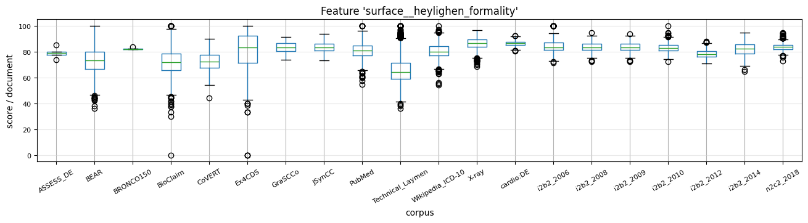
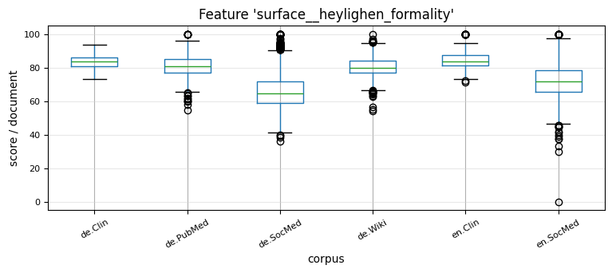

# Summary Analysis

This reporting describes characteristics in connection to the feature sets and can already demonstrate differences between text corpora.
After the process of metrics computation (resulting _Counts_ and _Metrics_) the DOPA METER is able to summarize scores (e.g., minimum, maximum, averages, quartiles).

The output of the task `features` is stored under the configured directories
* `path_features` ([example](../resources/results/features)),
* `path_counts` ([example](../resources/results/counts)) and
* `path_summary` ([example](../resources/results/summary)).

# Features

The directory of `features` contains the output of every metrics of the computed scores,
* for every feature set a subdirectory including a table formatted file for every corpus.

## Counts

The directory of `counts` contains the output of every metrics of the computed scores,
* for every feature set a subdirectory including a table formatted file for every corpus,
* for every feature set a table formatted file including the sum of all countable items of every corpus.

## Summary

The directory of `summary` contains the output of
* the table with corpus counts ([example](../resources/results/summary/corpora_characteristics_counts.csv)) and a directory with tables of every corpus with the document wise counts ([example](../resources/results/summary/))
* the corpus wise metrics in single table formatted files ([example directory](../resources/results/summary), [example file](../resources/results/summary/corpora_characteristics_emotion.csv) ),
* the for every metric a directory with a summary report for the document wise estimation of every corpus ([example](../resources/results/summary/lexical_richness)).

## Details

The output of the task `features_detail` is stored under the configured directory `path_features_detail` ([example](../resources/results/features_detail))

For every single metric of a _Feature Set_ scores can be visualized by box-plots, example:

* Corpora:
  
* Collections:
  

* [More examples](../resources/results/features_detail) of plotted and summarized features.

* **Decentralized approach:**
  * You can run the task `'features'` on different places.
  * You can combine the features via task `'features_detail'` if you copy the features `"path_features"` into one directory `"path_features"` and define it into one [configuration file](../resources/example_configurations).    

----
[Installation](../installation.md) | [Input & Data](../input.md) | [Functionality & Tasks](../tasks.md) | [Feature Hub](../features.md) | [Summarization](../analytics/summarization.md) | [Comparison](../analytics/comparison.md) | [Aggregation](../analytics/aggregation.md) | [Config & Run](../configuration.md)