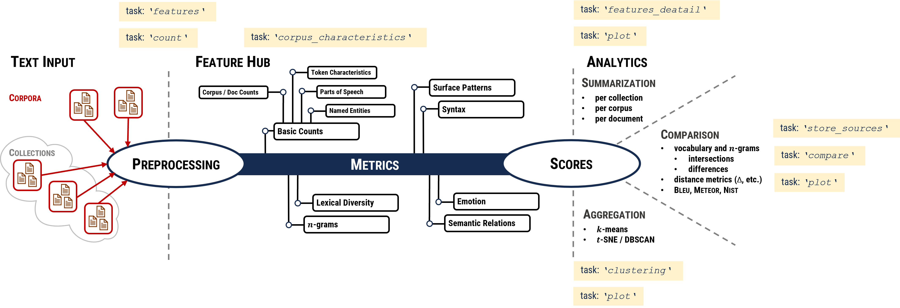

# Functionality and Definition of `tasks

## Functionality

Three components build the basis:
  1. **_Text corpora_** as the input and a preprocessing pipeline,
  2. **_Feature Hub_**: A set of features, that compute _counts_ and _metrics_ of text corpora and
  3. A three-parted **_analytics section_**:
     1. **_Summarization mode_**: of simple reports for whole corpora and single documents, 
     2. **_Comparison_**: simple comparisons (e.g., vocabulary, $n$-grams) via intersections and differences
     3. **_Aggregation_**: clustering by _k_-means and _t_-SNE with _DBSCAN_

## Tasks

DOPA METER contains a decentralized approach: it can compute features of different corpora on different places and combine the outcome (by csv file tables) into one overview of summary tables and plots.
To realize this and the functionality, there are some tasks defined (illustrated in following figure).

### Task `features`
* Computes features of a feature set per documents of given corpora
* Features are summarized by a set of features into ‘feature sets’, e.g., 'avg_token_len_chars‘ as part of the feature set ‘surface’)
* Input for tasks `'features_detail'`, `'cluster'`
* [Detailed definitions and configuration of features](doc/features.md)

### Task `counts`

* Compute occurrences of a given property of a feature per documents of corpora, all features, which are computed by occurrences of documents (e.g., dictionary lookup’s or single synsets from a semantic network) can describe by the 'counts‘ (useful to compare manual annotations of corpora)

### Task `features_detail`

* Combine single features of features sets, maybe computed on different places, for comparing in boxplots, e.g., the comparisons of all 'avg_token_len_chars‘ scores
* Mandatory: run of `'features'` before or in same run

### Task `corpus_characteristics`

* Simple description of corpora and all included documents by the amount of _documents_, _sentences_, _different_sentences_, _tokens_, _types_, _characters_, _lemmata_
* It is very useful to compare corpora by size descriptions, e.g. by definitions in scientific publications.

### Task `compare`

* Compare the amount of occurred 'counts‘ of $n$-grams, 
* It computes intersections and differences of corpora (csv files) and visualize it in heatmaps (plot mode):
  * Intersection of items, of the frequency of item and both portion-wise
  * Difference of items, of the frequency of item and both portion-wise
  * Intersections and differences stored in json-files.  
* Metrics
  * BLEU, METEOR, NIST
  * Distances metrics (only via vocabulary):
    * braycurtis
    * burrows2
    * canberra
    * chebyshev
    * correlation
    * cosine delta
    * eder distance
    * euclidean distance
    * manhattan distance
    * quadratic distance
    * squadratic distance
* Mandatory:
  1. Run of `'features'` before or in same run
  2. Store resources during featurization and (configuration in settings: `"store_sources": true`)

### Task `plot`

* Comparable features of feature sets are visualized by box plots and clustered corpora into scatter plots
* Set `plot` `True`, if you want to have plots.

### Task `cluster`

* Visualize dependencies between different corpora and produces scatter plots of clusters
Supported metrics: 
* [K-Means](https://scikit-learn.org/stable/modules/generated/sklearn.cluster.KMeans.html#sklearn.cluster.KMeans) (used sklearn libraries), input scaled by a MinMaxScaling
  * defaults (derived from org. defaults): 
    * `"n_clusters": 5`
    * `"random_state": "None"`
    * `"n_init": 50`
    * `"max_iter": 300`

* [T-SNE](https://scikit-learn.org/stable/modules/generated/sklearn.manifold.TSNE.html) with [DBSCAN](https://scikit-learn.org/stable/modules/clustering.html#dbscan) (used sklearn libraries)
  * defaults (derived from org. defaults):
    * `"n_components": 2`
    * `"random_state": 1`
    * `"perplexity": 500`
    * `"learning_rate": 500`
    * `"init": "pca"`
    * `"eps": 2` - parameter for DBSCAN
    * `"min_samples": 5` - parameter for DBSCAN
* Mandatory: Run of `'features'` before or in same run

----
[Installation](installation.md) | [Input & Data](input.md) | [Functionality & Tasks](tasks.md) | [Feature Hub](features.md) | [Summarization](analytics/summarization.md) | [Comparison](analytics/comparison.md) | [Aggregation](analytics/aggregation.md) | [Config & Run](configuration.md)